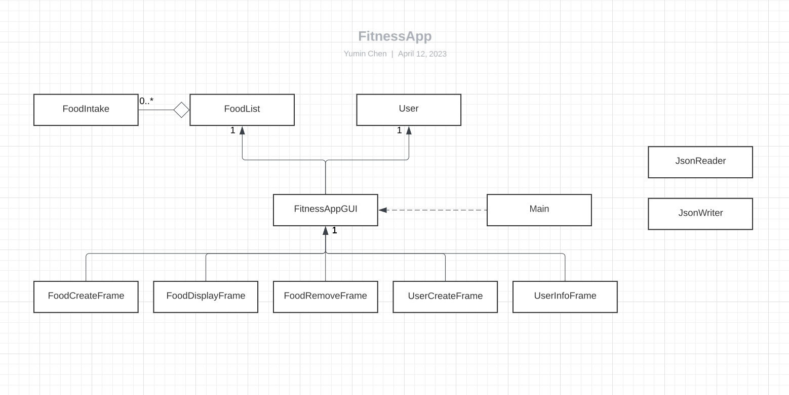

# My Personal Project

## What will the application do?
This program is a calorie tracker. It is designed to help users track and manage their daily food intake
and monitor their calorie consumption. The project is expected to provide a user-friendly interface that
allows users to input their meals and track the number of calories consumed for each meal.

## Who will use it?
**Anyone** who wants to maintain a healthy diet and achieve their fitness goals.

## Why is this project of interest to you?
There is a growing need for solutions that can help people make informed choices about their diet and
maintain a healthy lifestyle. The food calorie tracker project is a step in that direction, and it has
the potential to help people achieve their health goals and improve their overall well-being.

## User stories
- As a user, I want to input my information into the program and get my total daily energy expenditure.
- As a user, I want to be able to add food to my food bank.
- As a user, I want to be able to remove food from my food list.
- As a user, I want to view a list of my daily consumption of food.
- As a user, I want to be able to save my daily consumed food to food bank.
- As a user, when I start the application, I want to be given the option to load my daily consumed food from food bank.

## Phase 4: Event Logging and Design Reflection

### Task 2: Event Log Sample

 ```
Wed Apr 12 12:59:39 PDT 2023
Vanilla latte added to the Food Bank
Wed Apr 12 12:59:43 PDT 2023
Calculated user's total remaining calories: 1813
Wed Apr 12 12:59:58 PDT 2023
cheesecake added to the Food Bank
Wed Apr 12 13:00:00 PDT 2023
Calculated user's total remaining calories: 1463
Wed Apr 12 13:00:07 PDT 2023
cheesecake removed from the Food Bank
Wed Apr 12 13:00:08 PDT 2023
Calculated user's total remaining calories: 1813
```

### Task 3: Design Reflection

#### UML Diagram



The diagram follows a tree-like structure with
associations generally pointing in one direction.
There are no interfaces and abstract classes in the program.

#### Refactoring Possibilities

In my opinion, what would benefit this program the most
is to, instead of having JFrame for every button/function, it would be more
convenient for user to display everything in the same main frame.
That'd make the user experience a lot better. 